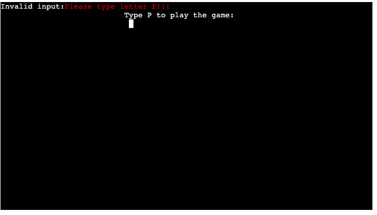

# **Hangman**

The Hangman Game project is a classic word-guessing game implemented in Python. The goal of the game is to guess a hidden word, one letter at a time, within a limited number of attempts. 

 - [View the Live Website Here](https://skeletan-hangman-9d89f5dd47f8.herokuapp.com/)

## Table of contents 
* [Hangman](#hangman)
    * [User Experience](#user-experience)
        * [Project Goals](#project-goals)
        * [User Stories](#user-stories)
        * [Colors](#colors)
        * [Technology Used](#technology-used)
          * [Languages](#languages)
		  * [Libraries](#libraries)
    * [Flow Chart](#flow-chart)
    * [Features](#features)
    * [Testing](#testing)
        * [Testing User Stories](#testing-user-stories)
        * [Validation Testing](#validation-testing)
        * [Bugs](#bugs)
        * [Manual Testing](#manual-testing)
    * [Future Features](#future-features)
    * [Deployment](#deployment)
    * [Credits](#credits)

## User experience

### Project Goals

- The goal is to offer an engaging game experience that maximizes user interaction. 

### User Stories

- As a player, I want to be able to create a username for the game
- As a player, I want to be able to know the rules of the game
- As a player, I want the game to show my progress in the game either by winning or losing.
- As a player, I want a warning message to appear on the screen if I accidentally enter an invalid character, or number 
  or just repeat the letter I used already
- As a player, I want to get some message if I win, and if I lose I want to know what was the secret word
- As a player, after every game, I want to be able to have the option to play again or not

### Colors
- Colored text will be shown across the game to make users more interested and attracted. Wrong inputs across the game will be shown in red color. Colors in the game are imported from Python Colorama Model

### Technology Used

- #### Languages:

   - Python

- #### Libraries
  * [Git](https://git-scm.com/)
    * Git was used for version control by utilizing the Gitpod terminal to commit to Git and push to GitHub
  * [GitHub](https://github.com/)
    * GitHub is used to store the project's code after being pushed from Git
  * [Heroku](https://id.heroku.com)
    * Heroku was used to deploy the live project
  * [Lucidchart](https://lucid.app/)
    * Lucidchart was used to creating the flowchart
  * [PEP8](http://pep8online.com/)
    * The PEP8 was used to validate all the Python code
  * [Patorjk](https://patorjk.com)
    * Patorjk (ASCII Art Generator) was used to create a banner across the game

## Flow Chart

Screenshots

The planning of this project was based on the flow charts using the platform Lucid Chart

## Features
### Welcome screen

Screenshots

- Welcomes a user to the game with the name input field

### Rules screen

Screenshots

- Describes rules to the user and how to play the game

### Game screen

Screenshots

- This is also a play screen on which a user is guessing letters from the hidden word. A user is displayed with multiple sections:  already tried letters, hidden word and hangman art in different stages depends on a user progress.

### End game screen

Screenshots

Screenshots

- A user is displayed with words expressing the win or lose message,the option to play the game again, , or exit the game

### Thank you screen

Screenshots

- A user is presented with ascci art thank you message

## Testing

### Testing User Stories

 - As a player, I want to be able to create a username for the game

| **Feature**  | **Action**                  | **Expected Result**                                          | **Actual Result** |
| ------------ | --------------------------- | ------------------------------------------------------------ | ----------------- |
| Welcome screen | There is a user name input field below the "Hangman" title | Type your username and press enter, your name will appear in later stages of the game | It works as expected |

-  As a player, I want to be able to know the rules of the game

| **Feature** | **Action**                           | **Expected Result**                                           | **Actual Result** |
| ----------- | ------------------------------------ | ------------------------------------------------------------- | ----------------- |
| Hangman rules screen | On the second screen type "R" and press "Enter" that will lead you to a separate screen which will display the rules of the game | Game rules are shown on the separate clear screen | It works as expected |

-  As a player, I want the game to show my progress in the game either by winning or loosing.

| **Feature** | **Action**                                 | **Expected Result**                                                                     | **Actual Result** |
| ----------- | ------------------------------------------ | --------------------------------------------------------------------------------------- | ----------------- |
| Game screen  | Start guessing random letters by inputting on the keyboard and pressing enter | Hangman art is displayed depending on the progress , a message with list of words used is shown as a secret word with right-guessed letters shown | It works as expected |

-  As a player, I want a warning message to appear on the screen if I accidentally enter an invalid character, number or just repeat the letter I used already

| **Feature** | **Action**                                     | **Expected Result**                                                                | **Actual Result** |
| ----------- | ---------------------------------------------- | ---------------------------------------------------------------------------------- | ----------------- |
| Game screen | Type either a special character, number or repeat letter you already guessed | Message to apear on top of the screen, to warn user about invalid input and not to count as try in the game | It works as expected |

-  As a player, I want to get some message if I win, and if I lose, I want to know what was the secret word

| **Feature** | **Action**                                     | **Expected Result**                                                                | **Actual Result** |
| ----------- | ---------------------------------------------- | ---------------------------------------------------------------------------------- | ----------------- |
| Game screen  | By either winning or losing the game new screen will display | Message on the top of the screen that will tell me If I won the game and a message with the completed art of hangman with a secret word will appear on the screen | It works as expected |

-  As a player, after every game I want to be able to have option to play again or not

| **Feature** | **Action**                                     | **Expected Result**                                                                | **Actual Result** |
| ----------- | ---------------------------------------------- | ---------------------------------------------------------------------------------- | ----------------- |
| End game screen  | After finishing the game message with options for the user will appear on the screen | By pressing "Y" to be directed to choose the level for another game | It works as expected |

 ### Validation Testing
- Used PEP8 Python Validator to validate my code

Validated code

 ### Bugs
| **Bug**                                                                                                         | **Fix**                                                                                                                                                       |

| Poor visual presentation of the game   | Introduced colorama and add spacing to the print statements across the game       |                                                                                            |
| After finishing the game once user was only able to choose a to play again after opting YES play again         | reworked the game() to be able to be called and game being able to be replayed
| Print statements from different screens were pilling up on top of each other, with user inputs and progress of the game | Imported os and created function which was used across the game to clear the terminal screen                                 |
| Too long lines during code                   | Fixed code using Chatgpt guided me what error was                             |

                                                                                                         
 ### Manual Testing
  #### Welcome screen

  

Screenshots

  - I've tested that the input field for name takes only alphabet letters and nothing else and that error message is displayed to the user that warns the user of his input

 #### Rules screen

Screenshots

  - I've tested that user can only input the letter "P" which will take a user to the next screen, the wrong input is displayed to the user

 #### Game screen

Screenshots

Screenshots

Screenshots

  - If a user repeats the letter that he already guessed error message will be displayed to the user
  - If a user inputs the number or any other special character error message will be displayed to the user
  - If a user inputs is wrong error message will notify the user 

#### End game screen

Screenshots

  - I've tested that the user is only allowed to input letters that are instructed on the screen and that with wrong input error message displays to user 

 #### Hangman game

  - I've tested that all instructions are displayed to the user and that all inputs that the user has to type will bring user to desired and expected outcome like it's displayed on the screens across the game

## Future Features
   - add leaderboard scoring
   - Use API services to randomly get words rather than storing them in folders
   - add three options which assists the client guess the word 
  
## Deployment
### Gitpod and git
 -  I created a repository in Github, named it Hangman, and used the template Code-Institute-org/python-essentials-template
 -  Once the repository is created, click the green button to the right (Gitpod) to open Gitpod
 -  In the terminal, I've used the python3 run.py file provided by the template
 - At regular appropriate intervals the latest version of the code was saved via the git add and git commit commands. Appropriate commit messages were added to control the revisions.
- The git push command was used to push all committed code and documentation to the repository for secure storage.
 

### Heroku
This project was deployed using Code Institutes mock terminal for Heroku.

-  Log in to Heroku and click "New" and "Create new app"
-  Name the new app and click "Create new app".
-  In "Settings" select "BuildPack" and select Python and Node.js. (Python must be at the top of the list).
-  While still in "Settings", click "Reveal Config Vars" and add the following; KEY: PORT, VALUE: 8000. and
content from creds.json file
-  Click on "Deploy" and select your deploy method and search for the repository name.
-  Click "Connect" on a selected repository.
-  Either choose "Enable Automatic Deploys" or "Deploy Branch" in the manual deploy section.
-  Heroku will now deploy the app.

## Credits
- Code & Content
  - I give credit to [Stack overflow](https://www.stackoverflow.com/), [MDN Web Docs](https://developer.mozilla.org/en-US/) & [W3 Schools](https://www.w3schools.com/) for helping me resolve issues with Python while coding through
  - Inspiration and guidance/problem solving through project came from [kite](https://www.youtube.com/@KiteHQ),youtube channels
  - Credits for code os.system('cls' if os.name == 'nt' else 'clear') that clear screen was found on [stackoverflow](https://stackoverflow.com/questions/2084508/clear-terminal-in-python)
  - Credits for my hangman art go to  [Ascii](https://ascii.co.uk/art/hangman)
  - To create banner for my page with title name I used [Patorjk](https://patorjk.com/)
  - Giving credit to [Lucid chart](ttps://www.lucidchart.com/) for providing tools to easily create my flow chart
  - Credits for centering my content in the terminal with the code  os.get_terminal_size().columns goes to [Geeksforgeeks](https://www.geeksforgeeks.org/)

- Acknowledgment
  - Special thank you goes to mentors Jubril who helped me to finish my project
